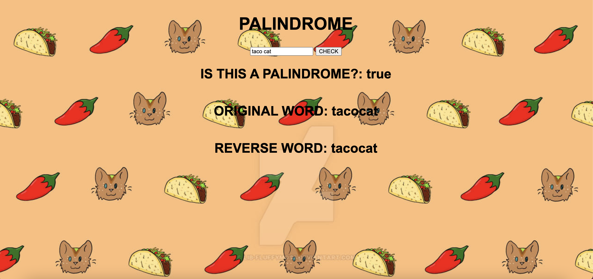

# 🎤 Week08 Bootcamp2019a Project: Server Side Palindrome Checker

### Goal: Create a simple web application that uses the fs and http modules to validate if a string is a palindrome server side.

This is my simple Palindrome Checker project! Users can enter a phrase or word and the app will check whether it is a palindrome or not.

</img>

Link to live site: [https://danielmtran-palindrome.netlify.app]

### How It's Made:

Tech used: HTML, CSS, JAVASCRIPT, Node.js

I made the basic styling and layout of the app via HTML and CSS. The main functionality of the app was made using Javascript and Node.js.

### Optimizations:

### Lessons Learned:

