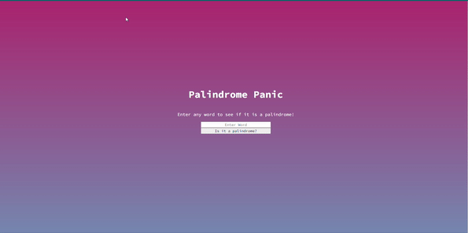

# Palindrome Panic

Welcome to my Palindrome Panic project. This server-side application uses the fs and http modules to validate whether a given string is a palindrome.

## How It's Made

Technologies Used: HTML, CSS, JavaScript, Node.js

In this project, I created a simple web application that checks if a given string is a palindrome. A palindrome is a word, phrase, number, or other sequences of characters that reads the same forward and backward (ignoring spaces, punctuation, and capitalization).

I used HTML to create the structure of the web page and included input fields for users to enter a string. The CSS was used to style the page and make it visually appealing. The core functionality was implemented in JavaScript, where I used the fs and http modules to validate whether the input string is a palindrome. If it is, the application displays a message indicating that the string is a palindrome; otherwise, it notifies the user that the string is not a palindrome.

This project allowed me to practice my front-end development skills and demonstrate my ability to create a simple, server-side application.

## Optimizations (optional)

During the development of this project, I focused on delivering a functional and user-friendly application. While I did not implement specific optimizations, I continuously refined and improved the code as I gained more experience. I learned the importance of efficient code and how it can significantly impact the user experience.

## Lessons Learned

Building this project was a great learning experience. It reminded me that being an engineer means continuous growth and learning. I encountered challenges and had moments of realization and excitement as I made progress. I found joy in solving problems and making the application work seamlessly. This project taught me the value of perseverance, self-awareness, and the satisfaction of creating something functional and user-friendly.

I look forward to further expanding my knowledge and skills in web development, and I am excited to take on new challenges in the future.
