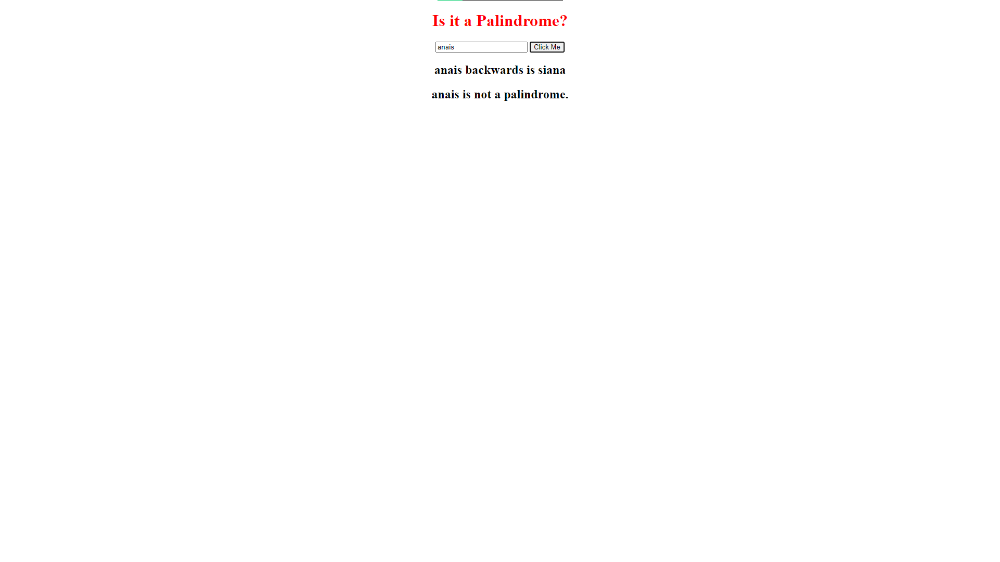

# Palindrome Checker 🔄

## Overview

This project is a simple web application that checks if a given string is a palindrome. The validation is done on the server side using the fs and http modules.

  

## How It's Made

### Tech used

- HTML
- CSS
- Node.js
- Vanilla JavaScript

### Implementation Details

- **HTML and CSS:**
  - Basic structure and styling for a clean user interface.

- **Node.js:**
  - Server creation and initiation.

- **Vanilla JS:**
  - Interaction with the backend to check if a word is a palindrome and dynamic display in the DOM.

- **Figlet for Error Message:**
  - Utilized Figlet for enhanced error messages.

## Lessons Learned 📚

- **Server Creation:**
  - Understanding and hands-on experience in creating and starting a server using Node.js.

- **Backend Interaction:**
  - Learning how to grab data from the user on the backend and display results in the DOM.

- **Node Modules:**
  - Knowledge gained about using Node modules for enhanced functionality and modularity.

## Getting Started 🚀

To get this project up and running, follow these simple steps:

1. **Clone or Download:**
   - Clone this repository using `git clone` or download the ZIP file.

2. **Navigate to the Project:**
   - `cd` into the project directory.

3. **Install Dependencies:**
   - Run `npm install` to install the necessary dependencies.

4. **Start the Server:**
   - Run `node server.js` to start the server.

5. **Open in Browser:**
   - Visit `http://localhost:8000` in your web browser.