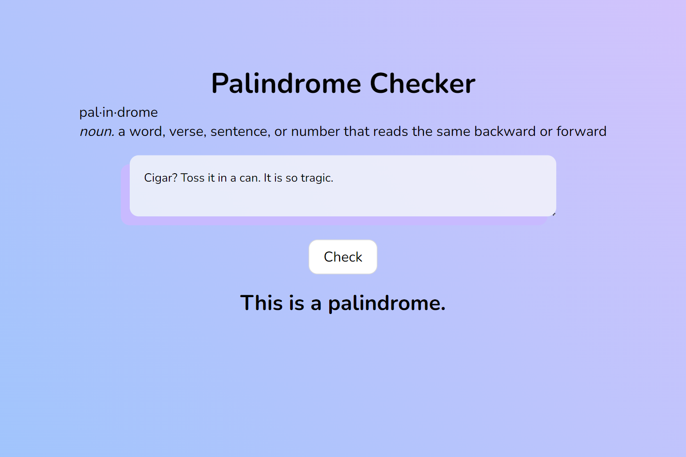

# Palindrome Checker 🔄

### Description
Welcome to the Palindrome Checker—a simple web application that helps you determine whether a given text is a palindrome or not. A palindrome is a word, verse, sentence, or number that reads the same backward or forward.

### How to Use
1. Input text in the text box.
2. Click on the "Check" button.
3. The app will display whether the entered text is a palindrome or not.

### Tech Used
- <strong>Node.js</strong>: Powering the server-side functionality.
- <strong>HTML, CSS, JavaScript</strong>: Crafting an interactive and visually appealing front-end.

### Lessons Learned
- <strong>Server-Side Development</strong>
    - <strong>HTTP Server</strong>: Creating a basic HTTP server using Node.js.
    - <strong>URL Paths</strong>: Using the `url` module to parse and handle different URL paths.
    - <strong>Query Parameters</strong>: Utilizing the `querystring` module to parse and extract parameters from the query string.
- <strong>Front-End Design</strong>
    - <strong>Interactive JavaScript</strong>: Implementing interactive features with JavaScript, such as fetching data from the server and updating the UI dynamically.
- <strong>External Libraries</strong>
    - <strong>Figlet</strong>: Integrating the Figlet library for generating ASCII art, adding a creative touch to error messages.
- <strong>Project Organization</strong>
    - <strong>File Structure</strong>: Organizing files into appropriate directories for efficient code management.
    - <strong>Resource Handling</strong>: Managing resources like HTML, CSS, and JS files appropriately.
- <strong>Local Deployment</strong>
    - Setting up and running the application locally for testing and development purposes.