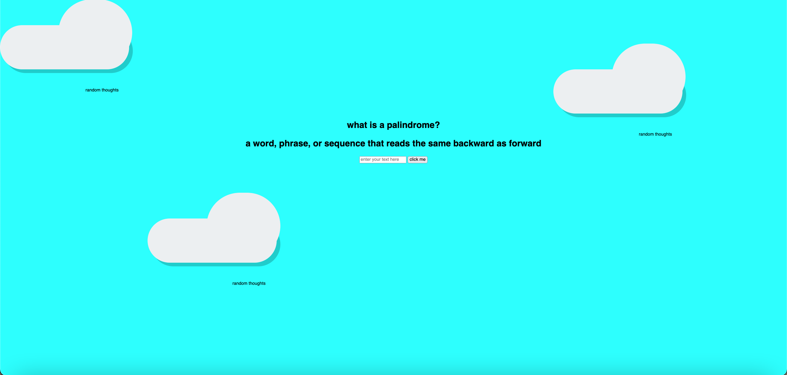

# Palindrome
This is a project for creating a palindrome checker. If you are not sure what this is, a palindrome is a word that is spelled the same backwards IE racecar spelled backwards is racecar. The user will enter text into the input and press a button. the request will get sent to the server where the logic will run an algorithm that reverses the spelling of the string and confirm that the reversed string is equal to the input string. 

**Link to project:** 

## How It's Made:

**Tech used:** HTML, CSS, JavaScript, node.js

This project was implemented using node.js without express. This means that the node.js core modules had to be hard coded including routes to be able to provide the logic back. A fetch response was used to send out the request, and a response was returned server side.

## Optimizations

## Lessons Learned:

Some great takeaways from this project are implementing node.js without express to see how core modules are used and how to hard code routes to return a response in JSON that is parsed by fetch syntax and provided the statement correct guess or incorrect guess.

## Examples: