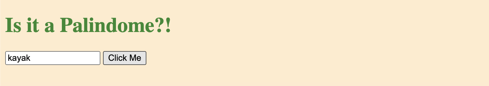

# ↔️ Week08 Bootcamp2019a Project: Server Side Palindrome Checker

### Goal: Create a simple web application that uses the fs and http modules to validate if a string is a palindrome server side.

# My Awesome Project
This simple web application used backend server side to display if the user's input is a palindrome. 

## How It's Made:

**Tech used:** HTML, CSS, JavaScript, Node.js

