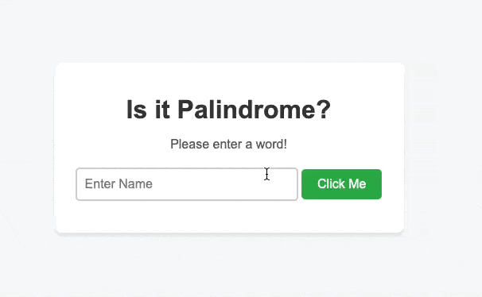

# My First Backend Application: Palindrome Checker

In this project, I ventured into the world of backend development to create a simple Node.js application that checks if a given string is a palindrome. A palindrome is a word, phrase, or sequence of characters that reads the same forward as backward (ignoring spaces, punctuation, and capitalization).

## Learning Journey

- **Node.js and HTTP Server**: I learned how to set up a basic HTTP server using Node.js and handle different HTTP requests.
- **Server-Side Logic**: Implementing the palindrome logic on the server side was a key learning point. This approach ensures that the logic is secure and cannot be tampered with by the end-users.
- **Parsing URL and Query Strings**: I got hands-on experience with parsing URLs and query strings to extract parameters from the HTTP requests.
- **Sending JSON Responses**: I learned how to send JSON responses back to the client and handle different HTTP status codes.
- **Handling Static Files**: I figured out how to serve static files like HTML, CSS, and JavaScript from the server.

## Project Structure

The main components of the project include:

- `server.js`: This is the heart of the application where the server is set up, and different HTTP requests are handled.
- `index.html`: The main HTML file that provides a user interface for inputting strings and displaying results.
- `css/style.css`: A simple CSS file to add some styling to the web page.
- `js/main.js`: The frontend JavaScript that interacts with the backend API.

## How to Run the Application

1. First, make sure you have Node.js installed on your computer.
2. Download or clone the project files to your local machine.
3. Open a terminal and navigate to the project's directory.
4. Run `npm install` to install the required dependencies.
5. Start the server with `node server.js`.
6. Open your browser and visit `http://localhost:8000`.
7. Enter a string in the input box and click the "Check" button to see if it's a palindrome.

## Backend Logic: Palindrome Check

Here is a simplified explanation of how the server handles palindrome checks:

```javascript
else if (page == "/api") {
	if ("palindrome" in params) {
		const word = params["palindrome"];
		if (word !== "") {
			const isWordPalindrome = isPalindrome(word);
			res.writeHead(200, { "Content-Type": "application/json" });
			res.end(JSON.stringify({ result: isWordPalindrome }));
		} else {
			res.writeHead(400, { "Content-Type": "application/json" });
			res.end(JSON.stringify({ error: "Please enter a word to check." }));
		}
	}
}
```

In this part of the code, when a request comes to the `/api` endpoint, the server checks if there is a `palindrome` parameter in the query string. If the parameter is there and not an empty string, the server runs the `isPalindrome` function to check if the word is a palindrome and sends the result back as a JSON object. If the parameter is missing or an empty string, the server responds with an error message, guiding the user to enter a word.

## Project Demo

Below is a gif demonstrating how the project works. You can see how the user inputs a word, clicks the "Check" button, and immediately receives feedback on whether the word is a palindrome or not.



## Conclusion

This project was a fantastic opportunity for me to dive into backend development, learn about server-side logic, and understand how to interact with APIs. I now feel more confident in my abilities to create backend functionalities and look forward to applying these learnings in future projects.
