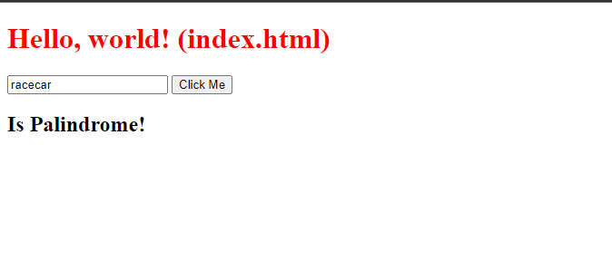

# *BOOM* Project: Server Side Palindrome Checker

This is my Server Side Palindrom checker project, a cool web application built with HTML, CSS, and JavaScript & Node.JS. It's about detected if a user input is a palindrom or not the server.

## How It's Made

I used HTML, CSS, and JavaScript Node.JS to create this project. This project was made using  the fs and http modules to validate if a string is a palindrome server side

## Lessons Learned

This was a great project to experiment with actual functions in the back-end to experiment & mess with the user's input

## Examples

If you want to see more of my work, feel free to explore my portfolio! [GitHub](https://github.com/Michaelariasdls).
